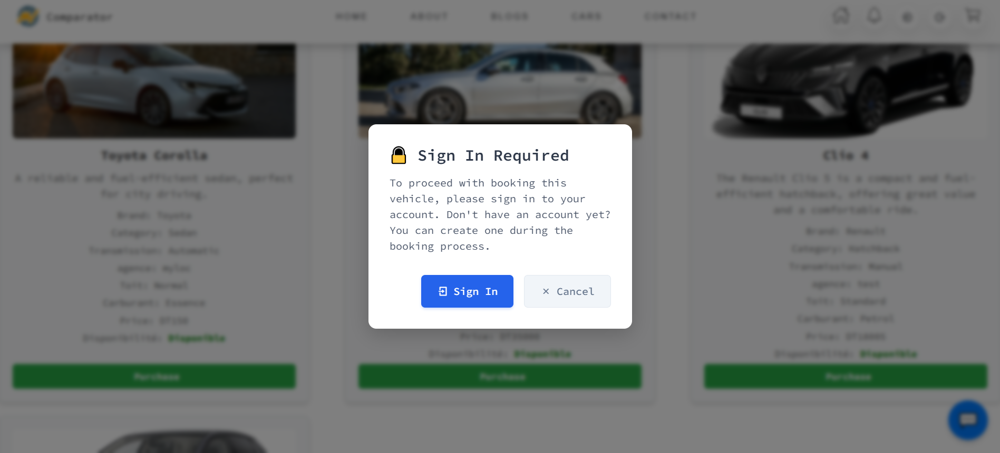
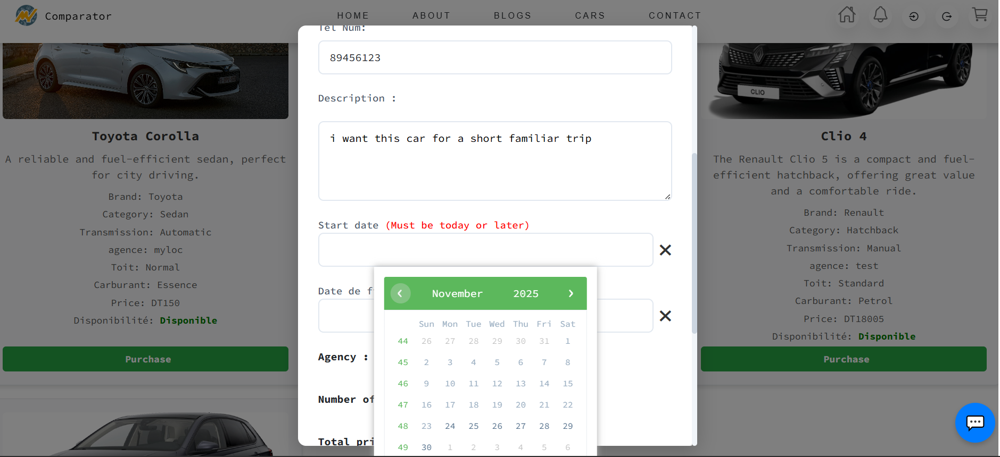

# Car Rental Platform — Full-Stack Application

A modern full-stack car rental platform built with **Angular**, **Spring Boot**, **FastAPI chatbot**, and **MySQL**, featuring **JWT & Keycloak authentication**, **email notifications**, **PDF + QR booking confirmations**, **real-time chat**, and **follower updates**. Future plans include **online payment via PayPal**, with automated payment link delivery.

---

## Table of Contents
1. [Project Overview](#project-overview)
2. [Features](#features)
3. [Architecture](#architecture)
4. [Frontend](#frontend)
5. [Backend](#backend)
6. [Chatbot](#chatbot)
7. [Online Payment](#online-payment)
8. [Security](#security)
9. [Notifications and Email System](#notifications-and-email-system)
10. [Booking Flow with PDF and QR](#booking-flow-with-pdf-and-qr)
11. [Deployment and CI/CD](#deployment-and-cicd)
12. [Screenshots and UI](#screenshots-and-ui)
13. [How to Run](#how-to-run)
14. [Author](#author)

---

## Project Overview

Multi-role platform supporting:
- **Admin:** Manages agencies, cars, blogs, and customers
- **Agency:** Manages cars and rental requests
- **Customer:** Books cars, comments, receives notifications
- **Follower:** Receives email updates about new cars and blogs

---

## Features
- **Car Management:** CRUD operations, photo uploads, filtering
- **Booking System:** Rental requests with agency approval
- **PDF + QR Generation:** Automated booking confirmations
- **Real-Time Chat:** Admin ↔ Agencies messaging
- **Blog Module:** CRUD operations with customer comments
- **Notifications:** Real-time alerts for bookings and messages
- **Follower System:** Email subscription service
- **AI Chatbot:** FastAPI-powered assistant
- **Role-Based Security:** Keycloak (Admin) + JWT (Others)
- **Dockerized Microservices:** Modular deployment
- **CI/CD Pipeline:** GitLab automation
- **Kubernetes:** Minikube-ready manifests

---

## Architecture    systemarchitecture.png


---

## Frontend
- **Framework:** Angular 16
- **Styling:** Bootstrap 5, FontAwesome, Remix Icons, Ionicons
- **Features:** Responsive design, car filtering, booking system, real-time chat


---

## Backend
- **Framework:** Spring Boot (Modular microservices)
- **Database:** MySQL
- **Features:** JWT security, DTO pattern, REST APIs
- **Services:** CarService, BookingService, ChatService, NotificationService, EmailService, PDFService, future PayPalPaymentService (planned)

---

## Chatbot
- **Framework:** FastAPI (Python)
- **AI Integration:** OpenAI GPT
- **Access:** Customers and visitors
- **Deployment:** Microservice architecture

---


## Online Payment
- **Provider:** Stripe
- **Integration:** Embedded in Backend (Port 8084)
- **Endpoints:**
  - POST /api/payment/create-checkout-session
  - GET /api/payment/session-status/{sessionId}
  - GET /api/payment/public-key
- **Features:**
  - Secure checkout via Stripe Checkout
  - Payment confirmation and status tracking
  - Email receipt after successful payment
  - Metadata linking to booking ID

---

## Security
- **Admin:** Keycloak authentication with realm roles
- **Users:** JWT-secured APIs for Agency/Customer/Follower
- **Frontend:** Angular AuthGuard for route protection

---

## Notifications & Email System
- **Real-Time Alerts:** Booking requests, agency decisions, chat messages
- **Email (SMTP):** Booking confirmations, PDF+QR documents, follower updates
- **Automated:** System-triggered notifications

---

## Booking Flow with PDF & QR
1. Customer requests car booking
2. Agency receives notification/email
3. Agency approves/rejects request
4. On approval:
   - Payment link sent to customer (**planned future PayPal integration**)
   - PDF+QR confirmation generated automatically
   - Documents emailed to customer
5. Real-time notifications updated

---

## Deployment and CI/CD

### Docker Services
| Service | Port | Description |
|---------|------|-------------|
| mysql | 3306 | MySQL Database |
| backend | 8084 | Spring Boot Backend (with Payment) |
| frontend | 4200 | Angular Frontend |
| ai-chatbot | 8000 | FastAPI Chatbot |

### CI/CD Pipeline
- **Platform:** GitLab CI/CD
- **Stages:** test, build_frontend, build_backend, build_images, push_images, deploy_minikube
- **Docker Registry:** Docker Hub (bayremboussaidi)

### Kubernetes Deployment
- **Platform:** Minikube
- **Namespace:** car-rent-app
- **Pods:** mysql, backend, frontend, ai-chatbot

## Screenshots & UI

| Feature                                  | Screenshot |
|------------------------------------------|------------|
| Keycloak Admin Panel                     |    |
| Realm Overview                            |  |
| Admin Car Listing                         |  |
| Edit Car Details (Admin)                  |  |
| Car List Interface for Client s Dashboard – Demo                      |  |
| Blog Management (Admin)                    |  |
| Booking History  - Demo                          |  |
|      Chatbot Interface       |  |
| Chat Interface (Admin ↔ Agency) – Demo with Test Agency                       |  |
| Notifications Table  ( Client )                       |  |
| Admin – Create Agency Page                 |  |
| Login Page                                 |  |
| Sign In Required for Booking (Customer)       |  |
| Car Availability Calendar (Only Available Dates Shown) |  |
| Rental PDF Confirmation Example Zahida Aloui – Client Demo | [Download PDF](screenshots/booking-confirmation.pdf) |
| Kubernetes Pods (Minikube) |  |

---

## How to Run

### Frontend
```bash
cd frontend
npm install
ng serve
```

### Backend
```bash
cd backend
mvn spring-boot:run
```

### FastAPI Chatbot
```bash
cd chatbot
pip install -r requirements.txt
uvicorn main:app --host 0.0.0.0 --port 8000
```


### Kubernetes (Minikube)
```bash
minikube start
kubectl apply -f k8s/namespace.yaml
kubectl apply -f k8s/mysql-deployment.yaml
kubectl apply -f k8s/backend-deployment.yaml
kubectl apply -f k8s/frontend-deployment.yaml
kubectl apply -f k8s/ai-chatbot-deployment.yaml
minikube dashboard
### Keycloak (Admin)
```bash
docker run -d --name keycloak \
  -p 9090:8080 \
  -e KEYCLOAK_ADMIN=bayrem \
  -e KEYCLOAK_ADMIN_PASSWORD=YourPassword \
  quay.io/keycloak/keycloak:21.1.1 start-dev
```


---

## Author

Bayrem Boussaidi  
Software Engineer — Angular | Spring Boot | Docker | Kubernetes | FastAPI | Microservices


